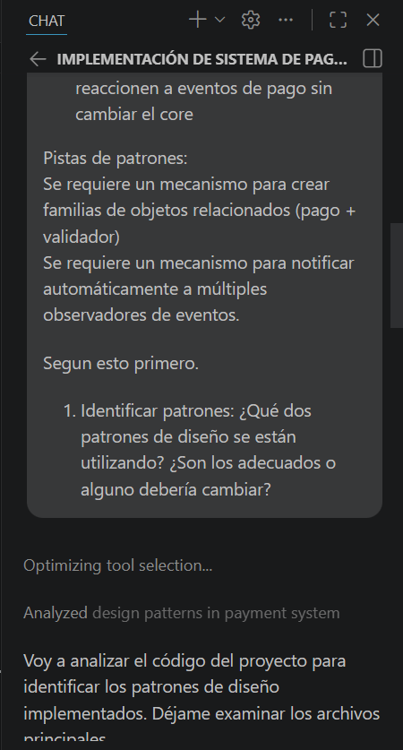
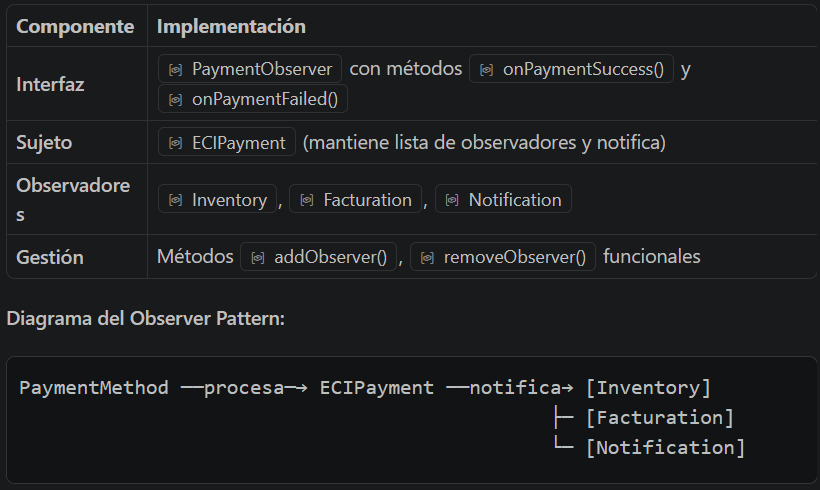
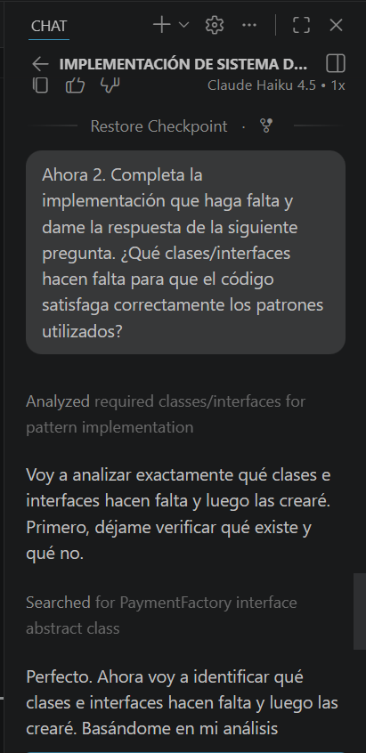
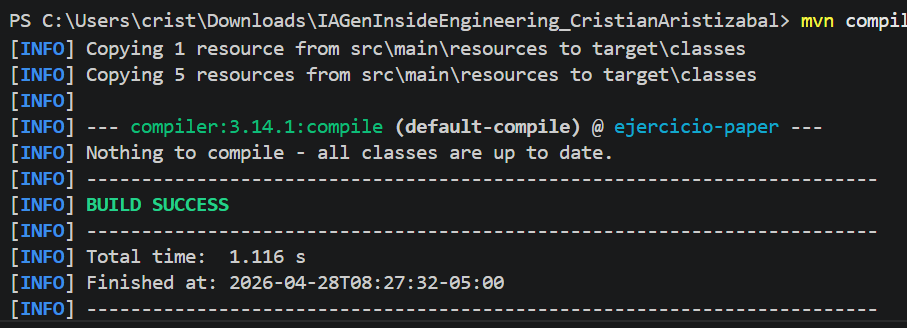

# Cristian Aristizabal - IAGen Inside Engineering

# 📄Solución Problema 1:

Contexto: Don Mario acaba de abrir un videoclub moderno donde los clientes pueden alquilar peliculas fisicas o digitales. El problema es que su sistema anterior era un caos: todos los precios se calculaban igual sin importar el tipo de pelicula o membresia del cliente, y no habia forma de saber que peliculas estaban disponibles en tiempo real.

Nos piden desarrollar lo siguiente:
Ayuda a Don Mario creando un sistema de alquiler que permita:
- Registrar peliculas (fisicas o digitales) con su disponibilidad.
- Que el cliente elija X peliculas para alquilar.
- Calcular el precio total segun su tipo de membresia:
-- Basica: precio normal.
-- Premium: 20% de descuento.
- Mostrar al finalizar un recibo con las peliculas, precio por unidad y total.

## SOLUCIÓN:
Primero le hicimos la siguiente pregunta a la IA:


Ya con el contexto y lo pedido a la IA le damos el siguiente prom:


TIEMPO: No alcance a terminar el primer punto, me demoré lo que hice los 15 min.

---

# 📄Solución Problema 2:
Descripción del Problema:

Una tienda virtual necesita implementar un sistema de pagos que soporte múltiples métodos de pago:

* Tarjeta de crédito
* PayPal
* Criptomonedas

Cada método tiene su propio proceso de validación y ejecución. El sistema debe:

1. Crear objetos de pago y sus validadores correspondientes
2. No exponer los detalles internos a la lógica principal de compras
3. Notificar automáticamente a otros componentes cuando se procesa un pago exitoso:
- 📦 Módulo de inventario: descontar del stock
- 📄 Módulo de facturación: generar factura
- 📧 Módulo de notificaciones: enviar correo al cliente

Requisitos Técnicos
La solución debe ser flexible para:

- ✅ Soportar nuevos métodos de pago sin modificar la lógica existente
- ✅ Permitir que nuevos módulos reaccionen a eventos de pago sin cambiar el core

Pistas de patrones:
Se requiere un mecanismo para crear familias de objetos relacionados (pago + validador)
Se requiere un mecanismo para notificar automáticamente a múltiples observadores de eventos

## Solución:

El primer PROMT que hice fue para el contexto del problema y para saber que patrones se usaron y si son los correctos o no.



### 1. Identificar patrones: ¿Qué dos patrones de diseño se están utilizando? ¿Son los adecuados o alguno debería cambiar?
RTA: 
- El primer patrón usado fue "Observer Pattern" y si esta bien implementado, tiene la interfaz PaymentObserver con diferentes metódos, contiene la siguiente información y el siguiente diagrama.



- Y el segundo patrón usado fue "Abstract Factory Pattern" el cuál tiene un problema, la clase de CreditCardFactory, PaypalFactory y CryptoFactory no son factories, son implementaciones concretas de PaymentMethod, asi que el código esperaria algo que no existe, no compilaría.

### 2. Completar implementación: ¿Qué clases/interfaces hacen falta para que el código satisfaga correctamente los patrones utilizados?

RTA:
- El prompt para esta pregunta fue el siguiente, le decimos de una vez que nos haga las correcciones que necesitemos, y nos de la respuesta a que hace falta para satisfacer el código:



Para que el código satisfaga correctamente el **Abstract Factory Pattern**, se necesitan las siguientes clases e interfaces:

#### **Clases/Interfaces Faltantes:**

| Tipo | Nombre | Propósito |
|------|--------|-----------|
| **Interfaz** | `PaymentFactory` | Define el contrato para crear métodos de pago |
| **Clase Concreta** | `CreditCard` | Implementación concreta de pago con tarjeta (extends PaymentMethod) |
| **Clase Concreta** | `PayPal` | Implementación concreta de pago con PayPal (extends PaymentMethod) |
| **Clase Concreta** | `Cryptocurrency` | Implementación concreta de pago con criptomonedas (extends PaymentMethod) |
| **Factory Concreta** | `CreditCardPaymentFactory` | Crea instancias de CreditCard (implements PaymentFactory) |
| **Factory Concreta** | `PayPalPaymentFactory` | Crea instancias de PayPal (implements PaymentFactory) |
| **Factory Concreta** | `CryptoPaymentFactory` | Crea instancias de Cryptocurrency (implements PaymentFactory) |

#### **Estructura del Patrón Abstract Factory (Corregida):**

```
PaymentFactory (interfaz)
    ├── CreditCardPaymentFactory (implementa)
    │   └── crea → CreditCard (extends PaymentMethod)
    │
    ├── PayPalPaymentFactory (implementa)
    │   └── crea → PayPal (extends PaymentMethod)
    │
    └── CryptoPaymentFactory (implementa)
        └── crea → Cryptocurrency (extends PaymentMethod)
```
Al implementar todo, podemos ver que el código y el problema compila perfectamente:



- TIEMPO DE SOLUCIÓN: Me demore los 20 min para desarrollarlo.